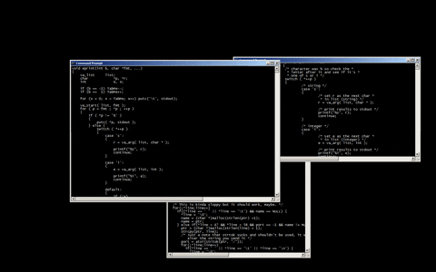

# ALL THINGS SHELL SCRIPT


## Basics
| Script Name | Description |
|------------|-------------|
| [hello_world](/basics/hello_world.sh) | Basic shell script that prints "Hello, World!" - demonstrates script execution |
| [variables](/basics/variables.sh) | Shows how to declare and use variables in shell scripts |
| [arguments](/basics/arguments.sh) | Demonstrates how to pass and handle command line arguments in shell scripts |
| [conditionals](/basics/conditionals.sh) | Examples of if-else statements, case statements and testing conditions in shell scripts |
| [for_loop](/basics/for_loop.sh) | Demonstrates script using for loop to create directories |
| [while_loop](/basics/while_loop.sh) | Demonstrates script using while loop to print numbers |
| [functions](/basics/functions.sh) | Shows how to create and use functions with parameters, return values, and variable scope |

## Create and  Execute a basic shell script
```
➜  all-things-shell-script git:(main) ✗ vim hello_world.sh
```

[hello_world Script](/basics/hello_world.sh)
```
#! /bin/bash
echo "Hello, World!"
```

change file permission in order to execute
```
➜  all-things-shell-script git:(main) ✗ ls -l
total 16
-rw-r--r--@ 1 hrushiborhade  staff  15 Mar 15 12:56 README.md
-rw-r--r--@ 1 hrushiborhade  staff  45 Mar 15 12:58 hello_world.sh

➜  all-things-shell-script git:(main) ✗ chmod 744 hello_world.sh

➜  all-things-shell-script git:(main) ✗ ls -l
total 16
-rw-r--r--@ 1 hrushiborhade  staff  15 Mar 15 12:56 README.md
-rwxr--r--@ 1 hrushiborhade  staff  45 Mar 15 12:58 hello_world.sh
```
```
➜  all-things-shell-script git:(main) ✗ ./hello_world.sh
Hello, World!
```
alternate to execute
```
➜  all-things-shell-script git:(main) ✗ bash hello_world.sh
Hello, World!
```

